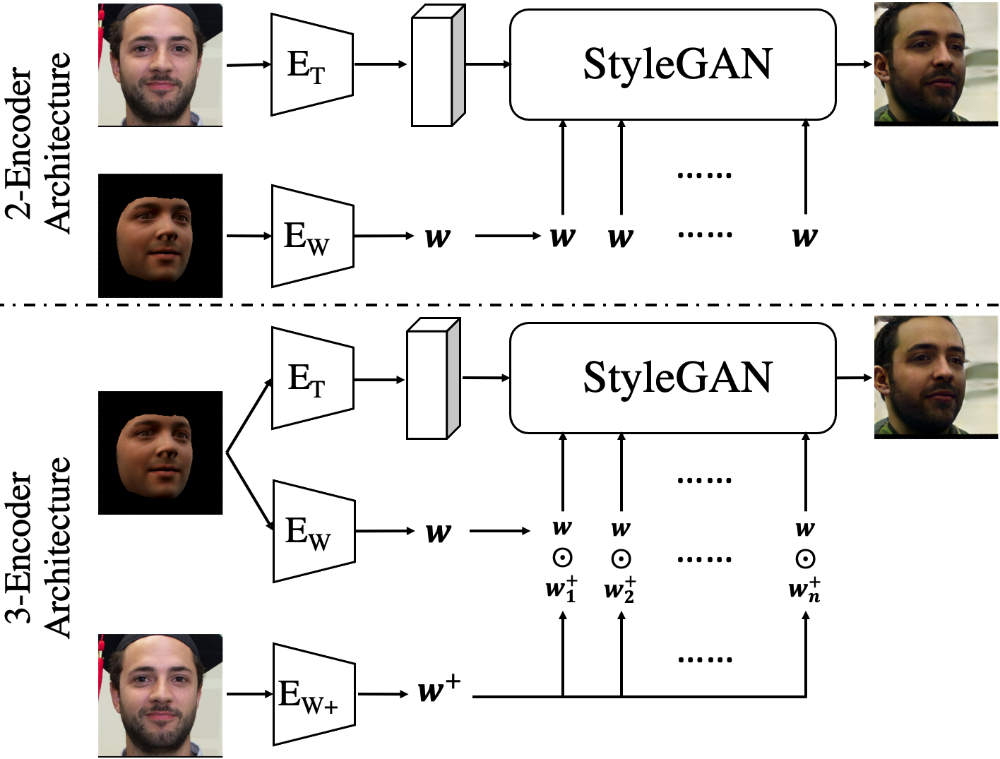

# 3D-FM GAN: Towards 3D-Controllable Face Manipulation [ECCV 2022] ([Paper](https://arxiv.org/abs/2208.11257))([Webpage](https://lychenyoko.github.io/3D-FM-GAN-Webpage/))([Video](https://www.youtube.com/watch?v=3tR7qIXyzLE))([Poster](https://lychenyoko.github.io/3D-FM-GAN-Webpage/resources/3D-FM%20GAN%20poster.pdf))

## Overview

The architecture of 3D-FM GAN is shown in the below image, 
where the inputs to the model are a photo image and a render image, 
and the output is a manipulated image bearing the identity from the photo while having the same facial attributes of pose, expression, and illumination as the render one.

### Environment Setup:

* `Conda_Env_Setup/2021_summer_env.yml`: Use `conda env create -f Conda_Env_Setup/2021_summer_env.yml` to install the conda environment.

### Training

* `train_3_encoder.py` & `train_3_encoder_hyperparams.py`: Training script and training hyper-parameter macros for 3-encoder architecture. Use `python3 train_3_encoder.py` to kick-off training.

### Evaluation

* `Evaluation/quant_eval.py`: Methods for quantitative evaluation, including FID, identity cosine similarity, landmark similarity, and face content similarity.

* `Evaluation/visual_eval.py`: Methods for visual evaluation by feed-forwarding different (photo,render) pairs to the model and visualize the outputs to assess the model's editability.
